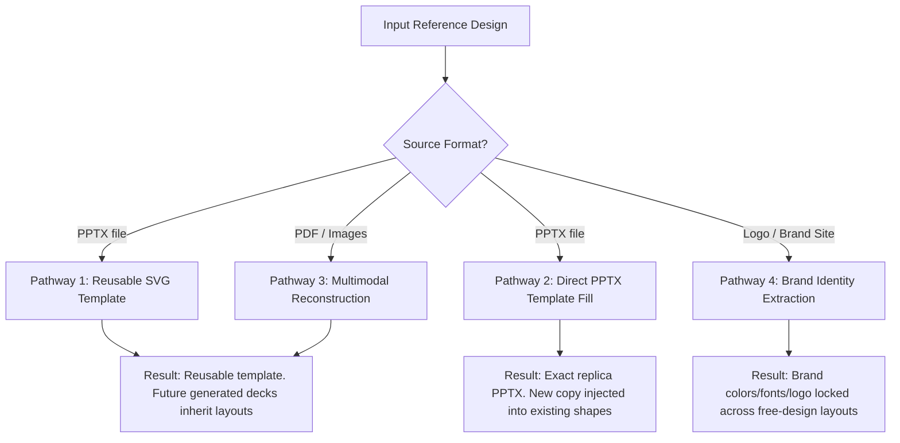

# Guide: Replicating Presentation Designs from PPTX, PDF, and Images

This guide describes how to replicate visual presentation designs from source files (PowerPoint, PDF, or images/screenshots) using the **Presentation Builder** framework. 

Depending on your source material and your goal, choose one of the four pathways:



---

## Pathway 1: Reusable SVG Template from PPTX (SVG Pipeline)

*   **When to use**: You have a designed `.pptx` file and want to extract its layout structures to generate *new* presentations dynamically using the SVG pipeline.
*   **Workflow Authority**: [create-template.md](core-ppt-master-engine/skills/ppt-master/workflows/create-template.md)

### Template Kinds: Deck vs. Layout
This workflow creates one of two kinds of templates depending on the branding content in the source `.pptx`:
1.  **Decks (`templates/decks/<id>/`)**: Default choice. Use this when the source file has a specific organization's brand identity (custom colors, logos, fonts, etc.).
2.  **Layouts (`templates/layouts/<id>/`)**: Use this when you only want to save generic, structural page layouts (without specific branding) and plan to apply different brands/styles downstream.

### Manual CLI Workflow (Example: Deck Template)
1.  **Extract the layouts and slide assets**:
    ```bash
    python3 core-ppt-master-engine/skills/ppt-master/scripts/pptx_template_import.py "path/to/reference_deck.pptx"
    ```
    *This outputs a structured folder under `/tmp/pptx_template_import/` containing a `manifest.json`, theme colors/fonts, and clean layout SVGs.*

2.  **Organize and register the template**:
    Create the template directory inside the library:
    *   **For Decks**: `mkdir -p "core-ppt-master-engine/skills/ppt-master/templates/decks/my_custom_deck"`
    *   **For Layouts**: `mkdir -p "core-ppt-master-engine/skills/ppt-master/templates/layouts/my_custom_layout"`

    *(Move the template files and your `design_spec.md` into this folder, then register it):*
    *   **For Decks**:
        ```bash
        python3 core-ppt-master-engine/skills/ppt-master/scripts/register_template.py my_custom_deck --kind deck
        ```
    *   **For Layouts**:
        ```bash
        python3 core-ppt-master-engine/skills/ppt-master/scripts/register_template.py my_custom_layout --kind layout
        ```

3.  **Generate a presentation using the template**:
    Pass the template path explicitly to the agent runner:
    *   **For Decks**:
        ```bash
        python3 run_agent.py --prompt "Create a 5-page deck about 'Project Phoenix Launch Plan' using the template at core-ppt-master-engine/skills/ppt-master/templates/decks/my_custom_deck/"
        ```
    *   **For Layouts**:
        ```bash
        python3 run_agent.py --prompt "Create a 5-page deck about 'Project Phoenix Launch Plan' using the template at core-ppt-master-engine/skills/ppt-master/templates/layouts/my_custom_layout/"
        ```

### Example Agent Runner Prompts
You can ask the agent runner to handle this workflow end-to-end. Be specific about whether it's a branded deck or a layout template:
*   **To create a branded Deck template**:
    > "Run the create-template workflow. Take the branded presentation design from `projects/references/sales_report_2025.pptx` and create a reusable deck template named `sales_theme` in the deck library."
*   **To create a brand-free Layout template**:
    > "Run the create-template workflow. Take the generic presentation design from `projects/references/generic_report.pptx` and create a reusable layout template named `report_layouts` in the layout library."

### The Company-Preferred `powerslides_infographics` Catalog
A collection of custom in-house infographics is registered as a **preferred visualization catalog** — it is *not* a layout and needs no explicit path. The Strategist consults it automatically on every run:
*   **Location**: `core-ppt-master-engine/skills/ppt-master/templates/charts/powerslides_infographics/` (index: `company_index.json`)
*   **Contents**: 30 infographic/roadmap/framework templates (timeline, process flow, 2x2 matrix, waterfall, swot, org tree, sankey, roadmaps, marketing calendars, and more).
*   **Precedence**: During Strategist §VII visualization matching, each page is matched against this catalog **before** the stock `charts/charts_index.json`. A fitting company template wins on ties; pages with no company match fall back to the stock chart catalog and then the standard fallback chain. See [`references/strategist.md`](core-ppt-master-engine/skills/ppt-master/references/strategist.md) §VII "Company catalog first".
*   **Execution**: Just describe the deck — no path needed. The preferred catalog is applied automatically:
    ```bash
    python3 run_agent.py --prompt "Create a 6-slide presentation about Project Launch Plan"
    ```

---

## Pathway 2: Direct PowerPoint Template Fill (Native OOXML Replacement)

*   **When to use**: You have a designed `.pptx` file and want to inject new text/bullet points directly into its existing layout placeholders—keeping the design, shapes, native charts, and tables **100% intact** without SVG conversion.
*   **Workflow Authority**: [template-fill-pptx.md](core-ppt-master-engine/skills/ppt-master/workflows/template-fill-pptx.md)

### Manual CLI Workflow
1.  **Analyze the presentation placeholders**:
    ```bash
    python3 core-ppt-master-engine/skills/ppt-master/scripts/template_fill_pptx.py analyze "projects/my_project/sources/template.pptx" -o "projects/my_project/analysis/slide_library.json"
    ```

2.  **Scaffold a fill plan**:
    Create a base layout plan referencing the source slides you wish to clone/use:
    ```bash
    python3 core-ppt-master-engine/skills/ppt-master/scripts/template_fill_pptx.py scaffold "projects/my_project/analysis/slide_library.json" -o "projects/my_project/analysis/fill_plan.json" --slides "1,3,4"
    ```

3.  **Verify text capacity limits**:
    Check if the text replacements you wrote fit inside the visual boundary of the template's shapes:
    ```bash
    python3 core-ppt-master-engine/skills/ppt-master/scripts/template_fill_pptx.py check-plan "projects/my_project/analysis/slide_library.json" "projects/my_project/analysis/fill_plan.json" -o "projects/my_project/analysis/check_report.json"
    ```

4.  **Apply content replacements**:
    ```bash
    python3 core-ppt-master-engine/skills/ppt-master/scripts/template_fill_pptx.py apply "projects/my_project/sources/template.pptx" "projects/my_project/analysis/fill_plan.json" -o "projects/my_project/exports/final_deck.pptx"
    ```

### Example Agent Runner Prompts
If you provide the template PPTX and a source text/document, the agent runner can automate the planning and fill execution:
> "Run the template-fill workflow. Fill the native PowerPoint template at `projects/sales/corporate_template.pptx` with the details from `projects/sales/q3_earnings.md`. Map the content to appropriate layouts."

---

## Pathway 3: Multimodal SVG Template from Images/PDFs

*   **When to use**: You have static images (PNG/JPG screenshots) or a PDF of slide layouts and want to reconstruct a matching design template.
*   **Workflow Authority**: [create-template.md](core-ppt-master-engine/skills/ppt-master/workflows/create-template.md)

### Workflow Details
Because images do not contain editable text layers or master shapes, this pathway relies on the LLM's **multimodal capability** to visually inspect the files and write clean template SVGs from scratch.

1.  **Analyze references visually**:
    The agent uses the multimodal visual recognition capabilities to analyze colors, layouts, font styles, and design elements from your screenshots or PDF.
2.  **Propose design specs**:
    The agent outputs a layout proposal outlining estimated hex colors, typography stacks, and the grid structure.
3.  **Reconstruct template SVGs**:
    The agent writes clean SVG pages matching the canvas format and registers the template into the global directory.

### Example Agent Runner Prompts
> "Analyze the slide screenshots inside `projects/my_references/` and reconstruct a new presentation layout template named `minimalist_dark`. Use the dark theme, neon green highlight accents, and two-column layouts seen in the images."

---

## Pathway 4: Brand Identity Extraction (Colors, Fonts, Logos)

*   **When to use**: You want to capture a brand's look and feel (colors, fonts, logos) from a website or style guide PDF so future generated slides automatically inherit these rules, while leaving the layout grids flexible.
*   **Workflow Authority**: [create-brand.md](core-ppt-master-engine/skills/ppt-master/workflows/create-brand.md)

### Manual CLI Workflow
1.  **Extract styling facts**:
    *   **From site URL**: `python3 core-ppt-master-engine/skills/ppt-master/scripts/source_to_md/web_to_md.py <URL>`
    *   **From PDF guide**: `python3 core-ppt-master-engine/skills/ppt-master/scripts/source_to_md/pdf_to_md.py <file>`
2.  **Write and Register the Brand Package**:
    Create the brand directory and write `design_spec.md` detailing the visual identity guidelines:
    ```bash
    mkdir -p "core-ppt-master-engine/skills/ppt-master/templates/brands/my_brand"
    # Copy logo.png and assets to this directory.
    ```
    Register the brand package:
    ```bash
    python3 core-ppt-master-engine/skills/ppt-master/scripts/register_template.py my_brand --kind brand
    ```

3.  **Use the brand guideline**:
    ```bash
    python3 run_agent.py --prompt "Create a 6-slide deck about our marketing campaign using the brand at core-ppt-master-engine/skills/ppt-master/templates/brands/my_brand/"
    ```

### Example Agent Runner Prompts
> "Run the create-brand workflow. Extract the corporate brand identity from `projects/brand/guidelines.pdf` and save the brand guidelines under `templates/brands/corp_brand`."

---

## CLI Options Reference for `run_agent.py`

When running the main execution agent (`run_agent.py`), you can use the following flags to customize execution:

| Flag | Description |
|---|---|
| `--prompt <str/file>` | Passes the prompt directly or points to a text file containing the prompt. |
| `--no-visual-review` | Skips the parallel visual self-check phase (speeds up runtime). |
| `--model <model>` | Specifies the Gemini model (defaults to `gemini-3.5-flash`). |
| `--verbose` | Streams model thoughts and detailed tool execution outputs on stdout. |
| `--thinking-level <level>` | Sets thinking budget: `MINIMAL`, `LOW`, `MEDIUM`, or `HIGH`. |
| `--resume` | Scans for incomplete/failed runs in output directories and resumes execution. |
